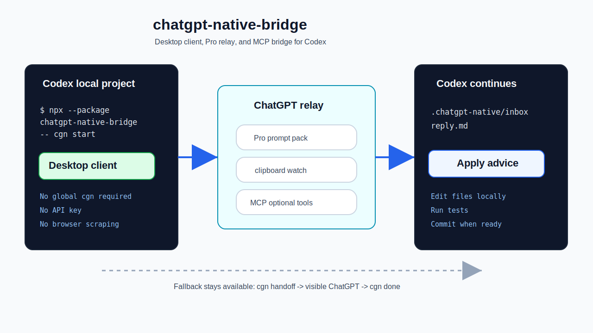
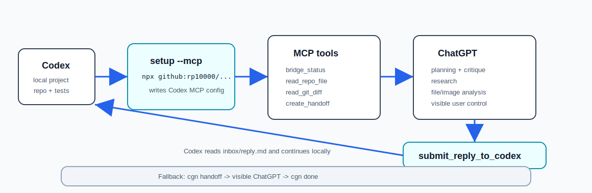

# chatgpt-native-bridge

[](https://github.com/rp10000/chatgpt-native-bridge/actions/workflows/ci.yml)

English | [简体中文](README.zh-CN.md)

Use ChatGPT's native web app as an MCP-connected planning, review, research, and visual-direction layer for Codex.

Codex executes locally. ChatGPT thinks, critiques, researches, reviews screenshots, and uses native ChatGPT tools through a local MCP bridge. No API key. No hidden endpoints. No scraping. No arbitrary shell execution.



> Public beta: the MCP-first Codex -> ChatGPT -> Codex workflow is usable, with Markdown handoff files retained as the fallback path.



## Why use this?

Codex is strong at local repo work: editing files, reading diffs, running tests, and carrying implementation through. ChatGPT's web app is useful for native workflows that are awkward to force through a local CLI:

- long-context planning
- architecture critique
- product and copy judgment
- UI/UX screenshot review
- web research and deep research
- image generation and visual direction
- file analysis, Canvas work, and long-running Project context
- second-pass review of Codex diffs and reports

This bridge gives ChatGPT a small MCP tool surface for local context, handoff creation, diff review, and reply import. Codex keeps execution authority: it edits files, runs tests, and decides what to accept locally.

## Codex-First Usage

Most users should not memorize every `cgn` command. Start from Codex:

```text
Install and initialize this tool in the current project:

https://github.com/rp10000/chatgpt-native-bridge

Run:
npx github:rp10000/chatgpt-native-bridge setup --mcp

Then run:
npx github:rp10000/chatgpt-native-bridge doctor

Tell me whether setup worked, whether I should restart Codex,
and where I should paste .chatgpt-native/project-instructions.md in a ChatGPT Project.
```

For daily use, trigger the Skill in Codex with one of these:

- run `/skills` and choose `chatgpt-native-bridge`
- type `$chatgpt-native-bridge`
- say `Use chatgpt-native-bridge for this task`

Do not use `/chatgpt-native-bridge`; custom Skills are selected through `/skills`, `$` mention, or natural language. Future plugin packaging may support an `@chatgpt-native-bridge` plugin entry.

## ChatGPT Web Connection

ChatGPT web does not accept `localhost` MCP URLs directly. Use the guide:

```bash
cgn mcp web
```

Fast path:

```bash
cgn mcp connect --yes --open
```

This starts the local MCP server, installs `cloudflared` if needed, starts a temporary HTTPS tunnel, copies the `https://.../mcp` Server URL to your clipboard, and opens ChatGPT. On Windows it tries `winget` first; if `winget` fails, it downloads `cloudflared.exe` into `.chatgpt-native/bin/` for this project.

ChatGPT cannot be created by a local CLI without using browser automation or hidden web calls. The final ChatGPT step is still visible and manual:

```text
Direct link:
  https://chatgpt.com/#settings/Connectors

If the direct link only opens ChatGPT:
  Settings -> Apps & Connectors -> Create

If there is no Create button:
  Settings -> Apps & Connectors -> Advanced settings -> turn on Developer Mode

New app fields:
  Name: chatgpt-native-bridge
  Description: Local Codex bridge. Use it to inspect bounded project context, read diffs, create handoff files, and submit ChatGPT advice back to Codex.
  Connection: Server URL
  Server URL: paste the copied https://.../mcp URL
  Authentication: No authentication
  Final step: click Create
```

## User Does Not Memorize Commands

```text
User describes task
  -> Codex decides whether bridge helps
  -> ChatGPT connects through local MCP when available
  -> ChatGPT reads bounded context, creates handoff files, or submits advice
  -> Codex reads reply.md and continues locally
```

When MCP is not available, the same loop falls back to:

```text
Codex runs cgn handoff
  -> User works in visible ChatGPT web
  -> User runs cgn done
  -> Codex reads reply.md and continues locally
```

## For Chinese Users

如果你第一次接触 Codex Skill、ChatGPT Project、handoff、outbox/inbox，建议从中文入口开始：

- [中文 README](README.zh-CN.md)
- [在 Codex 中使用](docs/zh-CN/在-Codex-中使用.md)
- [快速开始](docs/zh-CN/快速开始.md)

## Core workflow

```text
Codex local task
  -> cgn setup --mcp writes Codex MCP config
  -> Codex or ChatGPT MCP client starts the local stdio server
  -> ChatGPT reads bounded repo context and handoff files
  -> ChatGPT calls submit_reply_to_codex
  -> .chatgpt-native/inbox/{id}/reply.md
  -> Codex continues local implementation
```

Fallback workflow:

```text
Codex local task
  -> cgn handoff
  -> .chatgpt-native/outbox/{id}/
  -> ChatGPT web app with native tools
  -> cgn done
  -> .chatgpt-native/inbox/{id}/reply.md
  -> Codex continues local implementation
```

## 30-second quickstart

### 1. Initialize inside your Codex project

From this GitHub repo before npm publication:

```bash
npx github:rp10000/chatgpt-native-bridge setup --mcp
```

After npm publication:

```bash
npx chatgpt-native-bridge setup --mcp
```

For local development:

```bash
git clone https://github.com/rp10000/chatgpt-native-bridge.git
cd chatgpt-native-bridge
npm link
cgn setup --mcp
```

This creates:

```text
.agents/skills/chatgpt-native-bridge/SKILL.md
.chatgpt-native/project-instructions.md
.chatgpt-native/outbox/
.chatgpt-native/inbox/
```

If `cgn` is not installed globally, run any command through the GitHub package form:

```bash
npx github:rp10000/chatgpt-native-bridge doctor
npx github:rp10000/chatgpt-native-bridge handoff --task "Review pricing page" --type ux-review
```

### 2. Create a ChatGPT Project

Open ChatGPT, create a Project named:

```text
Codex Native Advisor
```

Paste this file into the Project instructions:

```text
.chatgpt-native/project-instructions.md
```

### 3. Ask Codex to use the bridge

In Codex:

```text
Use chatgpt-native-bridge when this task needs planning, UX review, research, visual direction, or diff review.
```

### 4. MCP-first local bridge

For Codex, `setup --mcp` installs this MCP server into `~/.codex/config.toml`:

```bash
cgn mcp install
```

Print connection hints:

```bash
cgn mcp config
```

Connect ChatGPT to:

```text
http://127.0.0.1:47832/mcp
```

Manual HTTP server fallback:

```bash
cgn mcp serve --host 127.0.0.1 --port 47832
```

Use ChatGPT Developer Mode or an official Secure MCP Tunnel when ChatGPT cannot directly reach your local machine. See [MCP setup](docs/MCP.md).

Available MCP tools:

| Tool | Purpose |
| --- | --- |
| `bridge_status` | Read local bridge, git, handoff, and reply status. |
| `create_handoff` | Create a self-explaining handoff pack. |
| `list_handoff_files` | List generated handoff files and upload candidates. |
| `read_handoff_file` | Read a bounded text file from the handoff outbox. |
| `read_repo_file` | Read a bounded non-sensitive repo file. |
| `read_git_diff` | Read the current git diff with secret-content guarding. |
| `submit_reply_to_codex` | Write ChatGPT's final advice into the local inbox for Codex. |

### 5. Markdown fallback beginner flow

```bash
cgn handoff \
  --task "Review the new pricing page" \
  --type ux-review,naming-copy \
  --include-diff \
  --include-screenshots "screenshots/*.png"
```

This creates the handoff, opens ChatGPT, copies `01_PASTE_TO_CHATGPT.md` to your clipboard, and prints the exact prompt path plus the upload/select list from the outbox. Then follow:

```text
.chatgpt-native/outbox/{id}/START_HERE.md
```

The same modes work with `cgn handoff`:

```bash
cgn handoff --task "Review pricing page" --mode assist
cgn handoff --task "Review pricing page" --mode manual
cgn handoff --task "Review pricing page" --mode auto
```

`--mode auto` prepares the handoff only. It does not paste, upload, or submit inside ChatGPT.

### 6. Import ChatGPT's answer manually

After ChatGPT responds, copy the answer and run:

```bash
cgn done
```

Codex can now read:

```text
.chatgpt-native/inbox/{id}/reply.md
```

### Advanced split flow

Advanced users can split the beginner command into separate steps:

```bash
cgn ask --task "Review pricing page" --type ux-review,naming-copy --include-diff
cgn open latest
cgn import latest --from-clipboard
```

MCP users should prefer `cgn setup --mcp` or `cgn mcp install`. `cgn handoff` is the recommended fallback path when MCP is unavailable. `cgn ask`, `cgn open`, and `cgn import` remain available for advanced workflows and Codex automation.

## Self-Explaining Handoff Files

Every handoff writes a small Markdown guide into `.chatgpt-native/outbox/{id}/`:

| File | Purpose |
| --- | --- |
| `START_HERE.md` | Full local instructions for the handoff loop. |
| `01_PASTE_TO_CHATGPT.md` | The prompt to paste into ChatGPT. `ask.md` is kept as a compatibility copy. |
| `02_UPLOAD_THESE_FILES.md` | Clear upload/select checklist with context, diff, tests, screenshots, and selected file status. |
| `03_AFTER_CHATGPT_REPLY.md` | What to do after ChatGPT responds. |
| `manifest.json` | Structured metadata for tools and debugging. |

After `cgn done`, the inbox also contains:

| File | Purpose |
| --- | --- |
| `reply.md` | ChatGPT's imported final answer. |
| `CODEX_READ_THIS.md` | Instructions for Codex to review `reply.md`, accept/reject/defer suggestions, continue locally, and run tests. |

## Why not just copy and paste?

| Approach | Tradeoff |
| --- | --- |
| Manual copy-paste | Easy to miss diffs, test output, screenshots, or relevant files. Context format changes every time. |
| Codex only | Good for local execution, but product judgment, visual critique, research, and second-pass review may benefit from ChatGPT web workflows. |
| OpenAI API only | Does not naturally use your visible ChatGPT Projects, Canvas, file upload, image generation, or other web-native workflows. |
| Browser RPA | Fragile, high-maintenance, and touches boundaries this project intentionally avoids. |
| `chatgpt-native-bridge` | ChatGPT uses a local MCP bridge when available; Markdown handoff files remain as a visible fallback. Codex continues local execution. |

## When to use it

| Scenario | Command shape |
| --- | --- |
| Complex requirement breakdown | `cgn handoff --task "..." --type plan,requirements` |
| Architecture review before a refactor | `cgn handoff --task "..." --type architecture --include-files "src/**/*.js"` |
| Page design or copy critique | `cgn handoff --task "..." --type ux-review,naming-copy --include-screenshots "screenshots/*.png"` |
| Research or current-source synthesis | `cgn handoff --task "..." --type research` |
| Visual direction or image prompts | `cgn handoff --task "..." --type image-direction --include-screenshots "screenshots/*.png"` |
| Final review after Codex changes | `cgn handoff --task "..." --type diff-review --include-diff --include-tests` |

## When not to use it

Do not use this for:

- typo-only changes
- formatting-only changes
- deterministic test fixes
- lockfile-only updates
- tasks containing secrets you are not willing to upload to ChatGPT

## Commands

```bash
# Beginner path
cgn setup --mcp
cgn mcp install
cgn mcp connect --yes --open
cgn mcp web
cgn mcp tunnel
cgn mcp doctor
cgn handoff --task "Review pricing page" --type ux-review --include-diff
cgn done

# Manual HTTP fallback
cgn mcp serve --host 127.0.0.1 --port 47832
cgn mcp config

# Advanced split flow
cgn init
cgn ask --task "Review pricing page" --type ux-review,naming-copy --include-diff
cgn open latest --mode assist
cgn open latest --mode manual
cgn open latest --mode auto
cgn import latest --from-clipboard
cgn status
cgn demo
cgn doctor
cgn guide codex
```

MCP users can start with `cgn setup --mcp`, `cgn mcp install`, and `cgn mcp doctor`. When MCP is unavailable, use `cgn setup`, `cgn handoff`, and `cgn done`. The older commands remain available for advanced users and for Codex to run directly.

`cgn demo` prints the end-to-end workflow. `cgn doctor` checks whether a project has the skill, Project instructions, outbox/inbox folders, and latest handoff/reply state. `cgn guide codex` prints a ready-to-copy prompt for Codex, and `cgn guide codex --lang zh-CN` prints the Chinese version.
The MCP server exposes only bounded local context tools and does not expose shell execution.

## Request types

- `plan`
- `requirements`
- `architecture`
- `naming-copy`
- `ux-review`
- `research`
- `image-direction`
- `diff-review`

ChatGPT can answer in free-form Markdown. The templates ask for a `Codex next actions` section when possible, but they do not require a strict schema.

## Safety boundary

The bridge has a lightweight secret guard. It blocks obvious sensitive paths or content:

- `.env` and `.env.*`
- private key files such as `*.pem`, `*.key`, SSH private keys
- cookie or session files
- private key blocks
- Authorization headers
- API key, token, secret, or password assignments
- `.git`
- `node_modules` through `read_repo_file`

This is intentionally not an enterprise data-loss-prevention system. Review what you include before uploading anything to ChatGPT.

The MCP server intentionally does not expose arbitrary shell execution, arbitrary file writes, commits, pushes, or browser automation. Its writes are limited to `.chatgpt-native/outbox` and `.chatgpt-native/inbox`.

## Docs

- [Quickstart tutorial](docs/quickstart.md)
- [MCP setup](docs/MCP.md)
- [MCP security boundary](docs/MCP_SECURITY.md)
- [Why this exists](docs/why.md)
- [Codex workflow prompts](docs/codex-workflow.md)
- [ChatGPT Project setup](docs/chatgpt-project-setup.md)
- [UX review tutorial](docs/tutorials/ux-review.md)
- [Image direction tutorial](docs/tutorials/image-direction.md)
- [Diff review tutorial](docs/tutorials/diff-review.md)
- [FAQ](docs/faq.md)
- [Troubleshooting](docs/troubleshooting.md)

## Examples

- [Basic planning handoff](examples/basic/README.md)
- [Frontend UX review](examples/frontend-ux-review/README.md)
- [Image direction](examples/image-direction/README.md)

## Development

```bash
git clone https://github.com/rp10000/chatgpt-native-bridge.git
cd chatgpt-native-bridge
npm install
npm link
cgn --help
npm test
npm run smoke
npm pack --dry-run
```

This package uses the official MCP TypeScript SDK plus Zod for MCP tool schemas.
