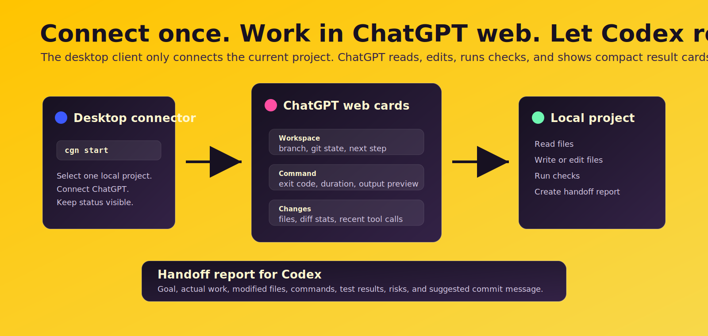

# chatgpt-native-bridge

[](https://github.com/rp10000/chatgpt-native-bridge/actions/workflows/ci.yml)

English | [简体中文](README.zh-CN.md)

**Connect once. Work in ChatGPT web. Let Codex review.**

ChatGPT Native Bridge turns ChatGPT web into a local project workspace through MCP. Pick one project in the desktop client, connect it, then ChatGPT can read files, edit files, run commands, show rich result cards, and create a handoff report for Codex to verify.



## Quick Start

For most Windows users, download the desktop installer:

[Download the latest Windows release](https://github.com/rp10000/chatgpt-native-bridge/releases/latest)

For CLI use, run this inside the project you want ChatGPT to work on:

```bash
npx --yes chatgpt-native-bridge start
```

If npm is unavailable, use the GitHub fallback:

```bash
npx --yes --package github:rp10000/chatgpt-native-bridge -- cgn start
```

The first-run flow is only three steps:

```text
1. Select project
2. Connect ChatGPT
3. Work in ChatGPT web
```

The desktop client stays small: project selection, connection state, local evidence, and handoff reports. ChatGPT web is the main workspace.

## Main Flow

1. Select the local project in the desktop client.
2. Click `Connect ChatGPT`.
3. Refresh or select the `chatgpt-native-bridge` tool in ChatGPT.
4. Ask ChatGPT to inspect, edit, and test the current project.
5. Ask ChatGPT to create a handoff report.
6. Let Codex review the diff, run tests, commit, and push.

The copied ChatGPT prompt says:

```text
Use chatgpt-native-bridge to open the current connected project. You may read files, edit files, and run required checks. When finished, create a handoff report describing what changed, what ran, and what Codex should review.
```

## Desktop Client

The client shows a single project and one large status light:


Status meanings:

- Gray: not connected.
- Blue: connected.
- Yellow: ChatGPT reached the tool list.
- Green: ChatGPT is operating on the current project.
- Purple: handoff report generated.
- Red: connection failed or project mismatch.

The main buttons are:

```text
Select project
Connect ChatGPT
Generate handoff report
```

Advanced details are still available behind collapsed panels: tool calls, shell commands, file changes, diagnostics, and fallback helpers.

## ChatGPT Web Cards

When your ChatGPT mode supports MCP Apps UI, tool results appear as compact cards in the ChatGPT conversation.


Cards are attached to the main workspace actions:

- open workspace
- read instructions, files, directories, and search results
- run command
- write or edit file
- command history
- show changes
- create handoff report

The cards show the status, key metrics, bounded details, and the next useful action. They do not add new permissions; they only render the structured MCP tool result.

If cards are not supported by your current ChatGPT account or mode, the tools still return normal structured results.

## MCP Workspace

After the project is connected, ChatGPT can use MCP workspace tools:

```text
list_workspaces
open_workspace
list_directory
search_workspace
read_project_instructions
read
write
edit
bash
command_history
show_changes
create_handoff_report
write_to_codex
```

The current connection is project-scoped. ChatGPT cannot browse your whole computer by default.

`open_workspace` opens the current connected project. If ChatGPT asks for a different path, the bridge rejects it and tells you to switch projects in the desktop client.

## Handoff Report

`create_handoff_report` creates:

```text
.chatgpt-native/reports/{id}/HANDOFF_REPORT.md
.chatgpt-native/inbox/{id}/reply.md
.chatgpt-native/inbox/{id}/CODEX_READ_THIS.md
```

The report includes:

- goal
- what ChatGPT actually did
- modified files
- key diff summary
- commands and results
- test results
- risks and remaining work
- suggested commit message
- ChatGPT notes
- Codex review steps

`write_to_codex` remains as a compatibility alias, but the preferred action is now `create_handoff_report`.

## Safety Boundary


The bridge is local-first and visible:

- No OpenAI API key required.
- No browser extension.
- No ChatGPT web scraping.
- No hidden ChatGPT endpoints.
- No global filesystem access by default.
- No automatic commit or push.
- Shell commands and file changes are visible in the desktop client.
- Codex still does the final local review, tests, commit, and push.

Treat the temporary MCP tunnel URL as a sensitive local capability URL.

## Modes

The default stays practical for project work:

```text
tool-mode: standard
shell-mode: trusted
```

For a simpler ChatGPT tool list:

```bash
cgn config set tool-mode simple
```

For safer shell access:

```bash
cgn config set shell-mode safe
```

`safe` allows common test, build, lint, and git inspection commands. Use `trusted` for full project shell access, or `off` to disable the workspace shell tool.

## CLI

```bash
cgn start
cgn desktop
cgn config show
cgn config set shell-mode safe
cgn config set tool-mode simple
cgn projects add .
cgn projects list
cgn mcp connect --yes --open
cgn mcp trace
cgn mcp doctor
cgn doctor
```

Use CLI for setup, diagnostics, automation, and advanced workflows. Use the desktop client for normal work.

## Pro Helper

ChatGPT Pro is a fallback planning path when the current ChatGPT chat cannot call MCP tools.

The Pro helper only uses packaged context:

```text
Client copies project context -> You paste it into Pro -> Client imports the marked reply
```

For real local file access, use the MCP workspace path.

## Fallback

If MCP is unavailable:

```bash
cgn handoff --task "Review this project"
cgn done
```

This creates a visible Markdown handoff and imports the ChatGPT reply back into `.chatgpt-native/inbox`.

## Development

Requires Node.js 20 or newer.

```bash
npm install
npm test
npm run desktop:dev
npm run desktop:pack
```

The npm package keeps the CLI lightweight. Desktop installers are published through GitHub Releases.

## Current Status

`v1.2` focuses on:

- Web-first MCP workflow
- current-project-only workspace access
- minimal desktop connector UI
- ChatGPT web cards
- local shell and file-change audit visibility
- configurable shell and tool modes
- handoff reports for Codex review
- Pro and Markdown fallbacks
