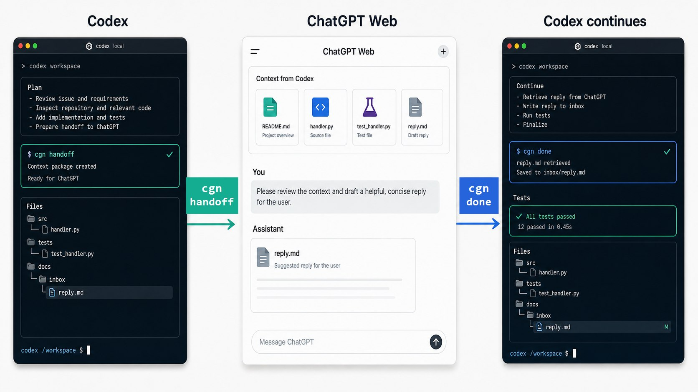

# chatgpt-native-bridge

[](https://github.com/rp10000/chatgpt-native-bridge/actions/workflows/ci.yml)

English | [简体中文](README.zh-CN.md)

Use ChatGPT's native web app as a visible planning, review, research, and visual-direction layer for Codex.

Codex executes locally. ChatGPT thinks, critiques, researches, reviews screenshots, and uses native ChatGPT tools. No API key. No hidden endpoints. No scraping.



> Public beta: the core Codex -> ChatGPT -> Codex handoff workflow is usable, but feedback is expected.


## Why use this?

Codex is strong at local repo work: editing files, reading diffs, running tests, and carrying implementation through. ChatGPT's web app is useful for native workflows that are awkward to force through a local CLI:

- long-context planning
- architecture critique
- product and copy judgment
- UI/UX screenshot review
- web research and deep research
- image generation and visual direction
- file analysis, Canvas work, and long-running Project context
- second-pass review of Codex diffs and reports

This bridge gives you a clean handoff between the two. It packages the right local context consistently, leaves the visible ChatGPT session under your control, then imports the answer so Codex can continue locally.

## Codex-First Usage

Most users should not memorize every `cgn` command. Start from Codex:

```text
Install and initialize this tool in the current project:

https://github.com/rp10000/chatgpt-native-bridge

Run:
npx github:rp10000/chatgpt-native-bridge init

Then run:
cgn doctor

Tell me whether setup worked and where I should paste
.chatgpt-native/project-instructions.md in a ChatGPT Project.
```

For daily use, trigger the Skill in Codex with one of these:

- run `/skills` and choose `chatgpt-native-bridge`
- type `$chatgpt-native-bridge`
- say `Use chatgpt-native-bridge for this task`

Do not use `/chatgpt-native-bridge`; custom Skills are selected through `/skills`, `$` mention, or natural language. Future plugin packaging may support an `@chatgpt-native-bridge` plugin entry.

## User Does Not Memorize Commands

```text
User describes task
  -> Codex decides whether bridge helps
  -> Codex runs cgn handoff
  -> User works in visible ChatGPT web
  -> User runs cgn done
  -> Codex reads reply.md and continues locally
```

## For Chinese Users

如果你第一次接触 Codex Skill、ChatGPT Project、handoff、outbox/inbox，建议从中文入口开始：

- [中文 README](README.zh-CN.md)
- [在 Codex 中使用](docs/zh-CN/在-Codex-中使用.md)
- [快速开始](docs/zh-CN/快速开始.md)

## Core workflow

```text
Codex local task
  -> cgn handoff
  -> .chatgpt-native/outbox/{id}/
  -> ChatGPT web app with native tools
  -> cgn done
  -> .chatgpt-native/inbox/{id}/reply.md
  -> Codex continues local implementation
```

## 30-second quickstart

### 1. Initialize inside your Codex project

From this GitHub repo before npm publication:

```bash
npx github:rp10000/chatgpt-native-bridge init
```

After npm publication:

```bash
npx chatgpt-native-bridge init
```

For local development:

```bash
git clone https://github.com/rp10000/chatgpt-native-bridge.git
cd chatgpt-native-bridge
npm link
cgn init
```

This creates:

```text
.agents/skills/chatgpt-native-bridge/SKILL.md
.chatgpt-native/project-instructions.md
.chatgpt-native/outbox/
.chatgpt-native/inbox/
```

### 2. Create a ChatGPT Project

Open ChatGPT, create a Project named:

```text
Codex Native Advisor
```

Paste this file into the Project instructions:

```text
.chatgpt-native/project-instructions.md
```

### 3. Ask Codex to use the bridge

In Codex:

```text
Use chatgpt-native-bridge when this task needs planning, UX review, research, visual direction, or diff review.
```

### 4. Create a handoff

```bash
cgn ask \
  --task "Review the new pricing page" \
  --type ux-review,naming-copy \
  --include-diff \
  --include-screenshots "screenshots/*.png"
```

### 5. Open ChatGPT

```bash
cgn open latest
```

This opens ChatGPT and copies `ask.md` to your clipboard. Upload `context.md`, `diff.patch`, selected files, and screenshots from the outbox when the task needs them.

### 6. Import ChatGPT's answer

After ChatGPT responds, copy the answer and run:

```bash
cgn done
```

Codex can now read:

```text
.chatgpt-native/inbox/{id}/reply.md
```

## Why not just copy and paste?

| Approach | Tradeoff |
| --- | --- |
| Manual copy-paste | Easy to miss diffs, test output, screenshots, or relevant files. Context format changes every time. |
| Codex only | Good for local execution, but product judgment, visual critique, research, and second-pass review may benefit from ChatGPT web workflows. |
| OpenAI API only | Does not naturally use your visible ChatGPT Projects, Canvas, file upload, image generation, or other web-native workflows. |
| Browser RPA | Fragile, high-maintenance, and touches boundaries this project intentionally avoids. |
| `chatgpt-native-bridge` | Codex packages context, ChatGPT works natively in a visible session, then Codex imports the answer and continues locally. |

## When to use it

| Scenario | Command shape |
| --- | --- |
| Complex requirement breakdown | `cgn ask --task "..." --type plan,requirements` |
| Architecture review before a refactor | `cgn ask --task "..." --type architecture --include-files "src/**/*.js"` |
| Page design or copy critique | `cgn ask --task "..." --type ux-review,naming-copy --include-screenshots "screenshots/*.png"` |
| Research or current-source synthesis | `cgn ask --task "..." --type research` |
| Visual direction or image prompts | `cgn ask --task "..." --type image-direction --include-screenshots "screenshots/*.png"` |
| Final review after Codex changes | `cgn ask --task "..." --type diff-review --include-diff --include-tests` |

## When not to use it

Do not use this for:

- typo-only changes
- formatting-only changes
- deterministic test fixes
- lockfile-only updates
- tasks containing secrets you are not willing to upload to ChatGPT

## Commands

```bash
cgn init
cgn setup
cgn ask --task "Review pricing page" --type ux-review,naming-copy --include-diff
cgn handoff --task "Review pricing page" --type ux-review --include-diff
cgn open latest
cgn import latest --from-clipboard
cgn done
cgn status
cgn demo
cgn doctor
cgn guide codex
```

New users can start with `cgn setup`, `cgn handoff`, and `cgn done`. The older commands remain available for advanced users and for Codex to run directly.

`cgn demo` prints the end-to-end workflow. `cgn doctor` checks whether a project has the skill, Project instructions, outbox/inbox folders, and latest handoff/reply state. `cgn guide codex` prints a ready-to-copy prompt for Codex, and `cgn guide codex --lang zh-CN` prints the Chinese version.

## Request types

- `plan`
- `requirements`
- `architecture`
- `naming-copy`
- `ux-review`
- `research`
- `image-direction`
- `diff-review`

ChatGPT can answer in free-form Markdown. The templates ask for a `Codex next actions` section when possible, but they do not require a strict schema.

## Safety boundary

The bridge has a lightweight secret guard. It blocks obvious sensitive paths or content:

- `.env` and `.env.*`
- private key files such as `*.pem`, `*.key`, SSH private keys
- cookie or session files
- private key blocks
- Authorization headers
- API key, token, secret, or password assignments

This is intentionally not an enterprise data-loss-prevention system. Review what you include before uploading anything to ChatGPT.

## Docs

- [Quickstart tutorial](docs/quickstart.md)
- [Why this exists](docs/why.md)
- [Codex workflow prompts](docs/codex-workflow.md)
- [ChatGPT Project setup](docs/chatgpt-project-setup.md)
- [UX review tutorial](docs/tutorials/ux-review.md)
- [Image direction tutorial](docs/tutorials/image-direction.md)
- [Diff review tutorial](docs/tutorials/diff-review.md)
- [FAQ](docs/faq.md)
- [Troubleshooting](docs/troubleshooting.md)

## Examples

- [Basic planning handoff](examples/basic/README.md)
- [Frontend UX review](examples/frontend-ux-review/README.md)
- [Image direction](examples/image-direction/README.md)

## Development

```bash
git clone https://github.com/rp10000/chatgpt-native-bridge.git
cd chatgpt-native-bridge
npm install
npm link
cgn --help
npm test
npm run smoke
npm pack --dry-run
```

This package has no runtime dependencies.
