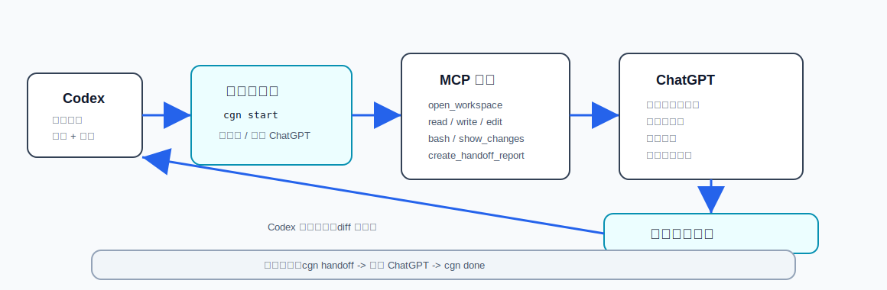

# chatgpt-native-bridge

[English](README.md) | 简体中文

让 ChatGPT 网页端通过本地 MCP 读取受限项目上下文、生成 handoff、提交建议；让 Codex 继续在本地写代码、跑测试、改文件。

不需要 OpenAI API key。
不调用隐藏接口。
不抓取 ChatGPT 网页。
不强制 JSON。
不提供任意 shell 执行。
你仍然在 ChatGPT 网页里使用原生功能。


> Public beta：v0.2.0 开始主路径是 MCP-first；原来的 Markdown handoff 继续作为备用路径。



## 最简单用法：把这段复制给 Codex

第一次安装时，不要先背 npm 或 `cgn` 命令。把下面这段直接复制给 Codex：

```text
请在当前项目安装并初始化这个工具：

https://github.com/rp10000/chatgpt-native-bridge

你可以优先运行：

npx --yes --package github:rp10000/chatgpt-native-bridge cgn setup --mcp

然后运行：

npx --yes --package github:rp10000/chatgpt-native-bridge cgn doctor

确认 .agents/skills/chatgpt-native-bridge/SKILL.md 和 .chatgpt-native/project-instructions.md 已生成。

最后告诉我：
1. 是否安装成功
2. 我是否需要重启 Codex
3. 我应该把 .chatgpt-native/project-instructions.md 粘到 ChatGPT Project 的哪里
```

## 日常怎么触发？

不要输入 `/chatgpt-native-bridge`。这不是官方 Skill 触发方式。

在 Codex 中推荐三种方式：

### 方式 A：`/skills`

输入 `/skills`，选择 `chatgpt-native-bridge`。

### 方式 B：`$` mention

输入：

```text
$chatgpt-native-bridge
```

然后描述你的任务。

### 方式 C：自然语言

```text
请使用 chatgpt-native-bridge 处理这个任务。
```

以后如果这个项目打包成 Codex Plugin，可能会支持 `@chatgpt-native-bridge` 这类插件入口；当前阶段请使用 `/skills`、`$chatgpt-native-bridge` 或自然语言。

## ChatGPT 网页怎么连接？

ChatGPT 网页不能直接填写 `localhost` MCP 地址。直接运行：

```bash
cgn mcp web
```

最快路径：

```bash
cgn mcp connect --yes --open
```

这条命令会启动本地 MCP server；缺少 `cloudflared` 时会自动安装；然后启动临时 HTTPS 隧道，把 `https://.../mcp` Server URL 复制到剪贴板，并打开 ChatGPT。Windows 上会先试 `winget`；如果 `winget` 下载失败，会把 `cloudflared.exe` 下载到当前项目的 `.chatgpt-native/bin/`。

在 ChatGPT 里选中应用以后，用这个命令确认它真的调用了 MCP：

```bash
cgn mcp wait
```

ChatGPT 界面里出现勾选，只表示应用被选中；`cgn mcp wait` 才能确认是否真的有工具调用到达本地。

本地 CLI 不能在不使用浏览器自动化或隐藏接口的情况下替你创建 ChatGPT 应用。最后一步仍然要在 ChatGPT 页面里手动点一次创建：

```text
直达链接：
  https://chatgpt.com/#settings/Connectors

如果直达链接只打开了 ChatGPT 首页：
  Settings -> Apps & Connectors -> Create

如果没有 Create 按钮：
  Settings -> Apps & Connectors -> Advanced settings -> 打开 Developer Mode

新应用字段：
  名称: chatgpt-native-bridge
  描述: Local Codex bridge. Automatically inspect bounded project context and diffs when useful, then submit final ChatGPT advice back to Codex.
  连接: Server URL
  Server URL: 粘贴已经复制好的 https://.../mcp
  身份验证: No authentication
  最后一步: 点击 Create
```

创建连接器以后，用户不需要记工具名。直接在 ChatGPT 里用自然语言：

```text
请使用 chatgpt-native-bridge 复核这个项目。
自动检查当前项目状态和 diff，需要上下文就读取相关文件，
最后把你的建议写回本地 Codex。
```

ChatGPT 应该自动通过 MCP 检查项目，并在结束前写回本地。然后回到 Codex 说：

```text
读取最新 ChatGPT 回复，然后继续。
```

如果 ChatGPT 没有开始调用连接器，就在 ChatGPT 里直接发：

```text
现在使用 chatgpt-native-bridge。
先调用 review_current_project。
只在需要时读取相关文件。
最后调用 submit_reply_to_codex，把最终建议写回 Codex。
```

## 我需要记哪些命令？

正常情况下，你不需要记住所有命令。

新手只需要记住：

- 第一次：让 Codex 运行 `npx --yes --package github:rp10000/chatgpt-native-bridge cgn setup --mcp`
- 日常：在 Codex 里使用 `$chatgpt-native-bridge` 或 `/skills`
- ChatGPT 回复后：运行 `cgn done`，或让 Codex 提醒你运行

其他命令主要是 Codex 或高级用户使用的底层能力。

## 用户不需要背命令

```text
用户说任务
-> Codex 判断是否需要 bridge
-> ChatGPT 通过本地 MCP 读取受限上下文
-> ChatGPT 生成建议并写回本地 inbox
-> Codex 读取 reply.md 并继续本地执行
```

如果当前账号或环境还不能使用 MCP，就走备用路径：

```text
Codex 运行 cgn handoff
-> 用户在 ChatGPT 网页里粘贴、上传、分析
-> 用户运行 cgn done
-> Codex 读取 reply.md 并继续本地执行
```

## 一句话解释

`chatgpt-native-bridge` 是一个给 Codex 用的本地桥接工具。

它做的事情很简单：

```text
本地启动 cgn mcp serve
-> ChatGPT 通过 MCP 读取受限上下文、diff、handoff 文件
-> ChatGPT 把最终建议写入 .chatgpt-native/inbox
-> Codex 继续修改、测试、总结
```

它不是 API wrapper。
它不是浏览器机器人。
它不偷抓 ChatGPT 输出。
它只是把“Codex 本地执行”和“ChatGPT 网页端高阶判断”通过 MCP 接起来。

## 它解决什么问题？

Codex 很适合做本地执行：

- 读 repo
- 改代码
- 跑测试
- 看 diff
- 修 bug
- 生成报告

但有些事情更适合交给 ChatGPT 网页端：

- 长上下文规划
- 需求澄清
- 架构批判
- 命名、定位、产品文案
- UI/UX 截图批判
- Web Search / Deep Research
- Canvas 长文档或方案整理
- 图片生成和视觉方向
- 对 Codex 生成的 diff / report 做二次复核

这个工具就是把两者接起来。

## 谁负责什么？

用户负责：

- 提出任务目标
- 在 ChatGPT 网页中粘贴 prompt、上传必要文件
- 把 ChatGPT 回复导回本地

Codex 负责：

- 读 repo、看 diff、整理上下文
- 运行 `cgn handoff` 生成 handoff
- 本地修改代码、跑测试、总结结果
- 读取 `reply.md` 后继续执行

ChatGPT 网页端负责：

- 规划
- 架构批判
- UI/UX 复核
- 研究
- 图片方向
- diff/report 二次审查

## MCP 主路径：让 ChatGPT 直接连接本地 bridge

启动本地 MCP server：

```bash
cgn mcp serve --host 127.0.0.1 --port 47832
```

查看连接提示：

```bash
cgn mcp config
```

检查本地状态：

```bash
cgn mcp doctor
```

ChatGPT 侧连接：

```text
http://127.0.0.1:47832/mcp
```

如果 ChatGPT 不能直接访问本机 `127.0.0.1`，请使用官方 ChatGPT MCP / Apps SDK / Secure MCP Tunnel 方式连接，不要使用隐藏接口、浏览器抓取、cookie/localStorage 提取或反向工程网页请求。

MCP 暴露的工具只有这些：

| 工具 | 用途 |
| --- | --- |
| `review_current_project` | 一次性项目复核入口：状态、git、受限 diff 和写回提示。 |
| `bridge_status` | 查看本地 bridge、git、handoff、reply 状态。 |
| `create_handoff` | 生成自解释 handoff 文件包。 |
| `list_handoff_files` | 列出 handoff 文件和可用附件。 |
| `read_handoff_file` | 读取 outbox 里的受限文本文件。 |
| `read_repo_file` | 读取项目里的受限非敏感文本文件。 |
| `read_git_diff` | 读取当前 git diff，并做 secret guard。 |
| `submit_reply_to_codex` | 把 ChatGPT 最终建议写入本地 inbox。 |
| `write_to_codex` | `submit_reply_to_codex` 的别名，方便 ChatGPT 查找写回动作。 |

MCP 不提供 shell，不改源码，不 commit，不 push。Codex 仍然是本地执行者。

## 手动模式：你自己运行命令

### 第 1 步：在你的项目里初始化

npm 发布前：

```bash
npx --yes --package github:rp10000/chatgpt-native-bridge cgn setup --mcp
```

npm 发布后：

```bash
npx chatgpt-native-bridge setup --mcp
```

本地开发：

```bash
git clone https://github.com/rp10000/chatgpt-native-bridge.git
cd chatgpt-native-bridge
npm link
cgn setup --mcp
```

这会生成：

```text
.agents/skills/chatgpt-native-bridge/SKILL.md
.chatgpt-native/project-instructions.md
.chatgpt-native/outbox/
.chatgpt-native/inbox/
```

如果没有全局安装 `cgn`，任何命令都可以用 GitHub npx 形式运行：

```bash
npx --yes --package github:rp10000/chatgpt-native-bridge cgn doctor
npx --yes --package github:rp10000/chatgpt-native-bridge cgn handoff --task "Review pricing page" --type ux-review
```

### 第 2 步：创建 ChatGPT Project

打开 ChatGPT，创建一个 Project，名字可以叫：

```text
Codex Native Advisor
```

然后把这个文件内容粘到 Project instructions：

```text
.chatgpt-native/project-instructions.md
```

### 第 3 步：在 Codex 里这样说

```text
这个任务如果需要规划、架构批判、UI/UX 复核、命名文案、研究、图片方向或 diff review，
请使用 chatgpt-native-bridge。

你来运行 cgn handoff 生成并打开 handoff。
告诉我需要在 ChatGPT 里粘贴什么、上传什么。
等我运行 cgn done 导入回复后，
你读取 .chatgpt-native/inbox/{id}/reply.md，
只采纳合理建议，继续本地修改、测试和总结。
```

也可以直接运行：

```bash
cgn guide codex --lang zh-CN
```

把输出复制给 Codex。

### 第 4 步：推荐新手流程

Codex 会运行类似：

```bash
cgn handoff \
  --task "Review the new pricing page" \
  --type ux-review,naming-copy \
  --include-diff
```

它会生成 outbox、打开 ChatGPT、复制 `01_PASTE_TO_CHATGPT.md`，并打印下一步卡片。然后按这个文件走：

```text
.chatgpt-native/outbox/{id}/START_HERE.md
```

它会：

```text
打开 ChatGPT
把 01_PASTE_TO_CHATGPT.md 复制到剪贴板
告诉你 Paste prompt 路径
列出 Upload/select 附件清单
告诉你 outbox 文件夹位置
```

这些模式适用于 `cgn handoff`。

如果你只想看路径、不打开浏览器、不碰剪贴板：

```bash
cgn handoff --task "..." --mode manual
```

如果你想让它尽量自动准备：

```bash
cgn handoff --task "..." --mode auto
```

`auto` 会打开 ChatGPT、复制 `01_PASTE_TO_CHATGPT.md`、打开 outbox 文件夹；它不会自动粘贴、自动上传或自动发送。

### 第 5 步：在 ChatGPT 里操作

在 ChatGPT 里：

```text
1. 粘贴 01_PASTE_TO_CHATGPT.md
2. 按 02_UPLOAD_THESE_FILES.md 上传 context.md / diff.patch / screenshots / files
3. 使用 ChatGPT 网页端原生功能分析
4. 复制 ChatGPT 最终回复
```

### 第 6 步：导回本地

```bash
cgn done
```

然后 Codex 读取：

```text
.chatgpt-native/inbox/{id}/reply.md
```

继续本地执行。

### 高级拆分流程

高级用户仍然可以把新手命令拆开：

```bash
cgn ask --task "Review pricing page" --type ux-review,naming-copy --include-diff
cgn open latest
cgn import latest --from-clipboard
```

MCP 用户优先使用 `cgn setup --mcp` 或 `cgn mcp install`。MCP 不可用时，备用主路径是 `cgn handoff` 和 `cgn done`。`cgn ask`、`cgn open`、`cgn import` 继续保留给高级流程和 Codex 自动调用。

## 自解释 handoff 文件

每次 handoff 都会在 `.chatgpt-native/outbox/{id}/` 里生成一组 Markdown 说明文件：

| 文件 | 用途 |
| --- | --- |
| `START_HERE.md` | 完整本地流程说明。 |
| `01_PASTE_TO_CHATGPT.md` | 真正要粘贴到 ChatGPT 的 prompt；`ask.md` 保留为兼容文件。 |
| `02_UPLOAD_THESE_FILES.md` | 清楚列出 context、diff、test-output、screenshots、files 是否存在和是否建议上传。 |
| `03_AFTER_CHATGPT_REPLY.md` | ChatGPT 回复之后怎么复制、运行 `cgn done`、让 Codex 继续。 |
| `manifest.json` | 给工具和排障使用的结构化元数据。 |

运行 `cgn done` 后，`.chatgpt-native/inbox/{id}/` 里会有：

| 文件 | 用途 |
| --- | --- |
| `reply.md` | 导入的 ChatGPT 最终回复。 |
| `CODEX_READ_THIS.md` | 给 Codex 的入口说明：读取 `reply.md`，区分采纳/拒绝/延期建议，继续本地实现并运行测试。 |

## 5 分钟真实例子：pricing 页面

你在 Codex 里说：

```text
帮我实现一个 pricing 页面。
实现前请使用 chatgpt-native-bridge 做规划、文案和 UI/UX 方向。
实现后再用 diff-review 做二次复核。
```

Codex 先运行：

```bash
cgn handoff \
  --task "Plan and critique a new pricing page" \
  --type plan,naming-copy,ux-review \
  --include-files "src/**/*pricing*" \
  --include-screenshots "screenshots/*.png"
```

你在 ChatGPT 里：

```text
1. 粘贴 01_PASTE_TO_CHATGPT.md
2. 按 02_UPLOAD_THESE_FILES.md 上传 context.md
3. 上传截图或相关文件
4. 让 ChatGPT 给出 Codex next actions
5. 复制最终回复
```

导回本地：

```bash
cgn done
```

再让 Codex：

```text
读取刚才导入的 ChatGPT 回复。
采纳合理的 must-fix 项，忽略不适合本 repo 的建议。
完成实现后运行测试，并再生成一次 diff-review handoff。
```

## 什么时候用？

| 场景 | 推荐类型 |
| --- | --- |
| 复杂需求拆解 | `plan,requirements` |
| 架构改动前复核 | `architecture` |
| 页面设计或文案批判 | `ux-review,naming-copy` |
| 当前信息研究 | `research` |
| 图片方向或视觉提示词 | `image-direction` |
| Codex 做完后的二次复核 | `diff-review` |

## 什么时候不要用？

不要为了这些事情使用 bridge：

- 只改错别字
- 只改格式
- 明确的测试失败修复
- 只更新 lockfile
- 包含你不愿意上传给 ChatGPT 的秘密信息

## 常用命令

```bash
# 新手主路径
cgn setup --mcp
cgn mcp install
cgn mcp connect --yes --open
cgn mcp wait
cgn mcp web
cgn mcp tunnel
cgn mcp doctor
cgn handoff --task "..." --type plan,ux-review --include-diff
cgn done

# 手动 HTTP 备用路径
cgn mcp serve --host 127.0.0.1 --port 47832
cgn mcp config

# 高级拆分流程
cgn init
cgn ask --task "..." --type plan,ux-review --include-diff
cgn open latest --mode assist
cgn open latest --mode manual
cgn open latest --mode auto
cgn import latest --from-clipboard
cgn status
cgn demo
cgn doctor
cgn guide codex --lang zh-CN
```

MCP 用户优先记 `cgn setup --mcp`、`cgn mcp web`、`cgn mcp tunnel`。

不能使用 MCP 时，新手优先记 `cgn setup`、`cgn handoff`、`cgn done`。旧命令继续保留给高级用户和 Codex 自动调用。

## 中文文档

- [MCP 设置](docs/MCP.md)
- [MCP 安全边界](docs/MCP_SECURITY.md)
- [快速开始](docs/zh-CN/快速开始.md)
- [在 Codex 中使用](docs/zh-CN/在-Codex-中使用.md)
- [ChatGPT 项目设置](docs/zh-CN/ChatGPT-项目设置.md)
- [使用场景](docs/zh-CN/使用场景.md)
- [常见问题](docs/zh-CN/常见问题.md)
- [故障排查](docs/zh-CN/故障排查.md)

## 当前边界

- GitHub 仓库已公开。
- npm registry 可能还没有发布，发布前请用 `npx --yes --package github:rp10000/chatgpt-native-bridge cgn setup --mcp` 或 `npm link`。
- MCP 是 v0.2.0 主路径；Markdown handoff 仍是备用路径。
- 不提供任意 shell 执行。
- 不提供浏览器 RPA。
- 不抓 ChatGPT 网页输出。
- 不接隐藏接口。
- 不替你判断哪些敏感文件可以上传；上传前仍要自己确认。
