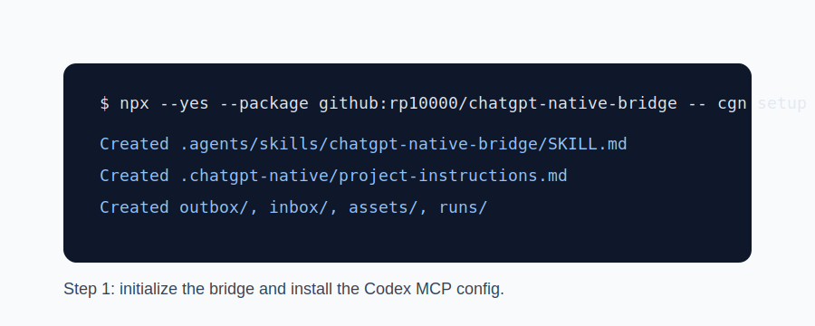
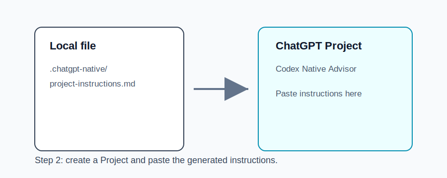
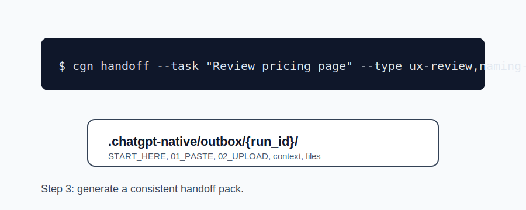
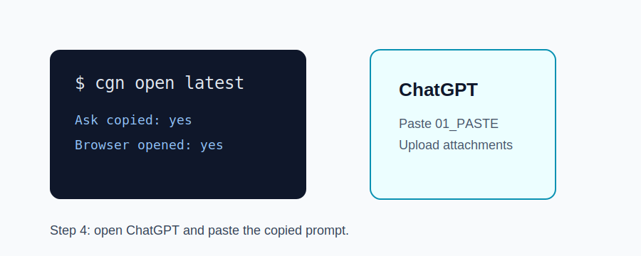
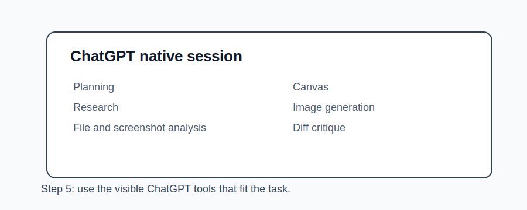
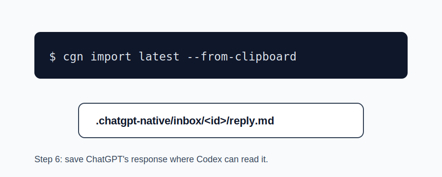
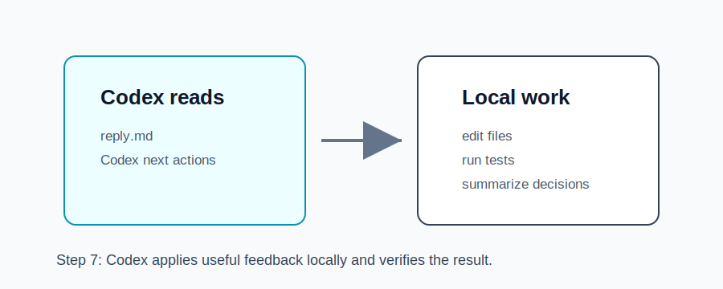

# Quickstart tutorial

This tutorial shows the full native handoff loop. It uses simple diagrams instead of private account screenshots.

## 1. Initialize the bridge



```bash
cgn init
```

This creates the Codex Skill and `.chatgpt-native` workspace.

## 2. Create a ChatGPT Project



Create a ChatGPT Project named `Codex Native Advisor`, then paste:

```text
.chatgpt-native/project-instructions.md
```

into the Project instructions.

## 3. Create and open a handoff



```bash
cgn handoff \
  --task "Review the new pricing page" \
  --type ux-review,naming-copy \
  --include-diff
```

The outbox contains self-explaining handoff files, context, and optional attachments.

## 4. Work in ChatGPT



Paste the copied `01_PASTE_TO_CHATGPT.md` prompt into ChatGPT. Upload files listed in `02_UPLOAD_THESE_FILES.md` only if the task needs them. Open `START_HERE.md` if you want the full local checklist.

## 5. Use ChatGPT native tools



Use the ChatGPT features that fit the task: file upload, image analysis, research, Canvas, or image generation.

## 6. Import the reply



```bash
cgn done
```

The answer is saved to:

```text
.chatgpt-native/inbox/{id}/reply.md
```

## 7. Codex continues locally



Ask Codex to read `reply.md`, apply the useful parts, ignore or defer the rest, and run relevant checks.
